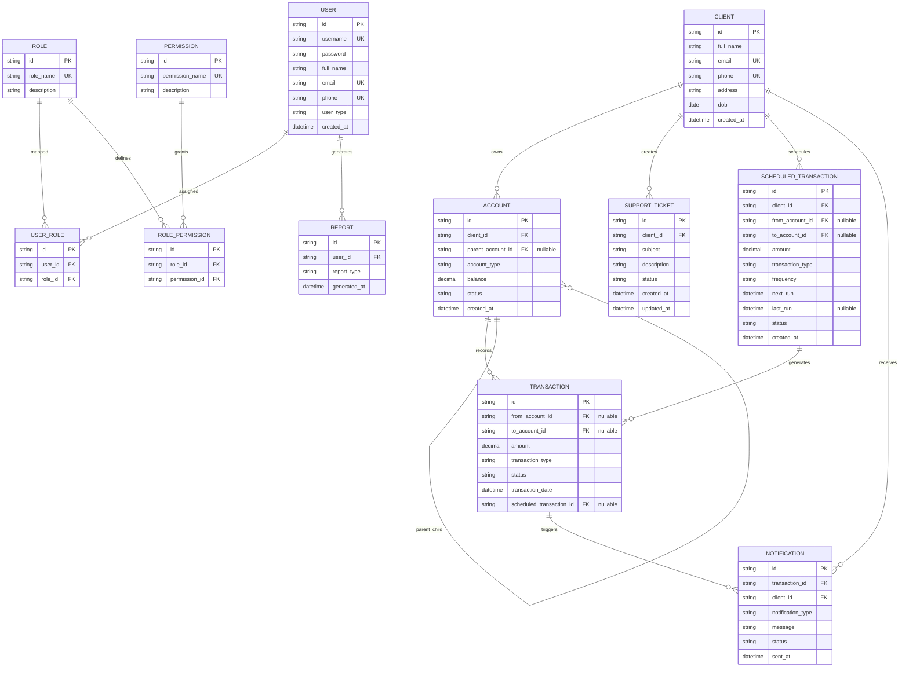

```mermaid
erDiagram
    %% ===== USERS & ACCESS CONTROL =====
    USER ||--o{ USER_ROLE : assigned
    ROLE ||--o{ USER_ROLE : mapped
    ROLE ||--o{ ROLE_PERMISSION : defines
    PERMISSION ||--o{ ROLE_PERMISSION : grants

    %% ===== CLIENT DOMAIN =====
    CLIENT ||--o{ ACCOUNT : owns
    CLIENT ||--o{ SUPPORT_TICKET : creates
    CLIENT ||--o{ SCHEDULED_TRANSACTION : schedules
    CLIENT ||--o{ NOTIFICATION : receives

    %% ===== ACCOUNT DOMAIN =====
    ACCOUNT ||--o{ TRANSACTION : records
    ACCOUNT ||--o{ ACCOUNT : parent_child

    %% ===== TRANSACTIONS =====
    SCHEDULED_TRANSACTION ||--o{ TRANSACTION : generates
    TRANSACTION ||--o{ NOTIFICATION : triggers

    %% ===== ADMIN / REPORTING =====
    USER ||--o{ REPORT : generates

    %% ===== TABLE DEFINITIONS =====

    USER {
        string id PK
        string username UK
        string password
        string full_name
        string email UK
        string phone UK
        string user_type
        datetime created_at
    }

    CLIENT {
        string id PK
        string full_name
        string email UK
        string phone UK
        string address
        date dob
        datetime created_at
    }

    ROLE {
        string id PK
        string role_name UK
        string description
    }

    USER_ROLE {
        string id PK
        string user_id FK
        string role_id FK
    }

    PERMISSION {
        string id PK
        string permission_name UK
        string description
    }

    ROLE_PERMISSION {
        string id PK
        string role_id FK
        string permission_id FK
    }

    ACCOUNT {
        string id PK
        string client_id FK
        string parent_account_id FK "nullable"
        string account_type
        decimal balance
        string status
        datetime created_at
    }

    TRANSACTION {
        string id PK
        string from_account_id FK "nullable"
        string to_account_id FK "nullable"
        decimal amount
        string transaction_type
        string status
        datetime transaction_date
        string scheduled_transaction_id FK "nullable"
    }

    SCHEDULED_TRANSACTION {
        string id PK
        string client_id FK
        string from_account_id FK "nullable"
        string to_account_id FK "nullable"
        decimal amount
        string transaction_type
        string frequency
        datetime next_run
        datetime last_run "nullable"
        string status
        datetime created_at
    }

    SUPPORT_TICKET {
        string id PK
        string client_id FK
        string subject
        string description
        string status
        datetime created_at
        datetime updated_at
    }

    NOTIFICATION {
        string id PK
        string transaction_id FK
        string client_id FK
        string notification_type
        string message
        string status
        datetime sent_at
    }

    REPORT {
        string id PK
        string user_id FK
        string report_type
        datetime generated_at
    }
```
