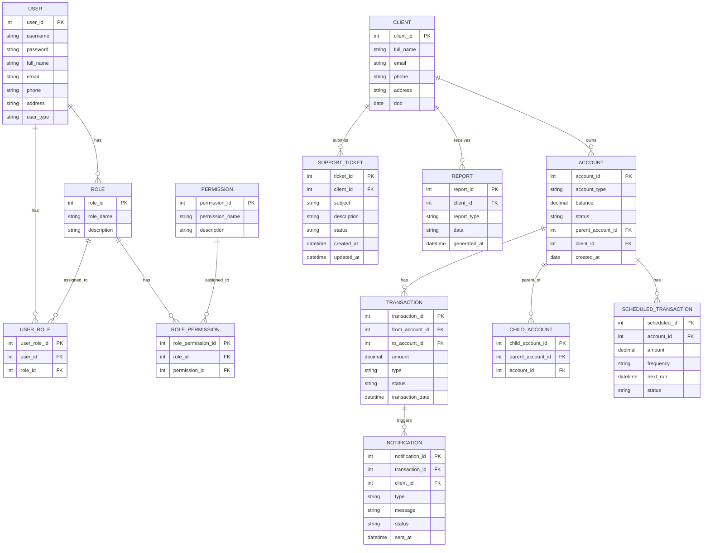

```mermaid
erDiagram
    USER ||--o{ ROLE : has
    USER ||--o{ USER_ROLE : has
    ROLE ||--o{ USER_ROLE : assigned_to
    ROLE ||--o{ ROLE_PERMISSION : has
    PERMISSION ||--o{ ROLE_PERMISSION : assigned_to

    CLIENT ||--o{ ACCOUNT : owns
    CLIENT ||--o{ SUPPORT_TICKET : submits
    CLIENT ||--o{ REPORT : receives
    ACCOUNT ||--o{ TRANSACTION : has
    ACCOUNT ||--o{ CHILD_ACCOUNT : parent_of
    ACCOUNT ||--o{ SCHEDULED_TRANSACTION : has
    TRANSACTION ||--o{ NOTIFICATION : triggers

    USER {
        int user_id PK
        string username
        string password
        string full_name
        string email
        string phone
        string address
        string user_type
    }

    CLIENT {
        int client_id PK
        string full_name
        string email
        string phone
        string address
        date dob
    }

    ROLE {
        int role_id PK
        string role_name
        string description
    }

    USER_ROLE {
        int user_role_id PK
        int user_id FK
        int role_id FK
    }

    PERMISSION {
        int permission_id PK
        string permission_name
        string description
    }

    ROLE_PERMISSION {
        int role_permission_id PK
        int role_id FK
        int permission_id FK
    }

    ACCOUNT {
        int account_id PK
        string account_type
        decimal balance
        string status
        int parent_account_id FK
        int client_id FK
        date created_at
    }

    CHILD_ACCOUNT {
        int child_account_id PK
        int parent_account_id FK
        int account_id FK
    }

    TRANSACTION {
        int transaction_id PK
        int from_account_id FK
        int to_account_id FK
        decimal amount
        string type
        string status
        datetime transaction_date
    }

    SCHEDULED_TRANSACTION {
        int scheduled_id PK
        int account_id FK
        decimal amount
        string frequency
        datetime next_run
        string status
    }

    SUPPORT_TICKET {
        int ticket_id PK
        int client_id FK
        string subject
        string description
        string status
        datetime created_at
        datetime updated_at
    }

    NOTIFICATION {
        int notification_id PK
        int transaction_id FK
        int client_id FK
        string type
        string message
        string status
        datetime sent_at
    }

    REPORT {
        int report_id PK
        int client_id FK
        string report_type
        string data
        datetime generated_at
    }
```